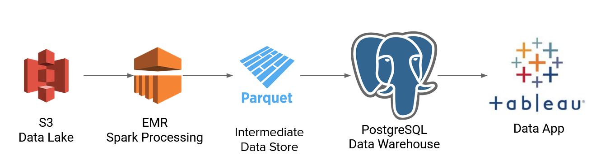

# TranZip 
TranZip is a lead generation tool that helps Logistic Companies find businesses that ship internationally by looking at 
the types and quantity of packages these businesses are shipping. TranZip uses the US Customs and Border Protections 
Automated Manifest System (AMS) to query the most relevant information to gain business intelligence about business' 
shipping activity. 

# Table of Contents
1. [Files](README.md#Files)
2. [Pipeline](README.md#Pipeline)
3. [Imports](README.md#Imports)
2. [Purpose](README.md#Purpose)
2. [Usage](README.md#Usage)
2. [Input](README.md#Input)
2. [Output](README.md#Output)
2. [Known Issues](README.md#Known-Issues)
2. [Updates](README.md#Updates)
2. [Contact](README.md#Contact)

# Files
`sparkSubmitAMS.py` - main python script for passing the primary parsing script to AWS EMR

`sparkAMS.py` - primary python script that gets passed to AWS EMR by `sparkSubmitAMS.py`

`readAllParquetUpdateSQL.py` - python script to update PostGreSQL database and create new tables as necessary.

Input files are the 33 AMS files.
# Pipeline

# Repository Structure
<pre>
├── other               Extra Resources
└── src                 Python Scripts for Spark-Submit and moving data to PostGreSQL
README.md               README.md File
</pre>

## Imports
boto3, pyspark, sqlalchemy, awswrangler 
<installation instructions for imports>
<push to dev instead>
<git install look at ronaldo's git>

cryptography (encryption was used for SQL username and password however the scripts or encrypted files were not uploaded to GitHub, instead you may hard code the necessary information into `sparkAMS.py`)

## Purpose
Process and clean

### Usage
The AMS file locations are set in `sparkSubmitAMS.py` with 

Command Prompt:
`python3.7 sparkSubmitAMS.py`

Syntax:
`python3.7 ./src/sparkSubmitAMS.py`

To update the database, use the `readAllParquetUpdateSQL.py` file to update the database with the generated Parquet files. 

Command Prompt:
`python3.7 readAllParquetUpdateSQL.py`

Syntax:
`python3.7 ./src/readAllParquetUpdateSQL.py`

### Input
11 AMS files for each year available (33 files in total).

### Output
The initial processing and cleaning of the data will produce Parquet files

File `readAllParquetUpdateSQL.py` will grab the Parquet files and update the PostGreSQL database. 

### Known Issues
- Additional cleaning of the dataset is necessary. 
- Many links are currently hard coded for the MVP

### Updates
Version 0.0.15 - 24 Jun 2020
- Updated README.md

Version 0.0.12 - 22 Jun 2020
- Added text to README.md
- Modified schema for date columns in summary data

Version 0.0.11 - 22 Jun 2020
- Added Some Tariff Clean Up

Version 0.0.10 - 20 Jun 2020
- Rewrote code for a single Spark Submit for all files

Version 0.0.09 - 19 Jun 2020
- Added python script to move data to SQL database
- Code Clean Up
- Added some documentation

Version 0.0.05 - 13 Jun 2020
- Added results now output from spark as CSV or Parquet files

Version 0.0.04 - 11 Jun 2020
- Added AWS EMR (Spark) to process and print results to stdout
- 3 separate spark submits created

Version 0.0.03 - 8 Jun 2020
- Initial python only conversion of CSV to Parquet

Version 0.0.1 - 4 Jun 2020
- Initial Commit

## Contact
Edmund Young

dryoung@solidstate.dev
